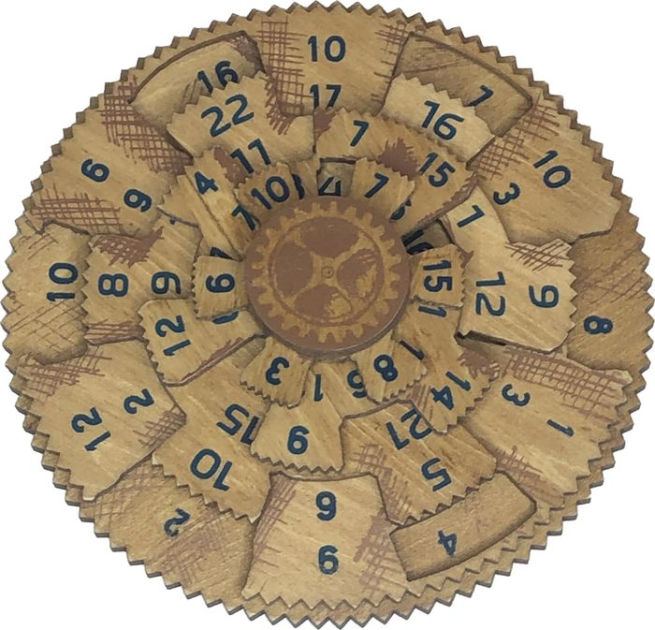

# greek-computer

Solver for the Greek Computer puzzle

The goal of this puzzle is to manipulate each moving wheel to where the visible numbers in each radial all add up to 42.

Running this app via `cargo run` will output:

* The position of each wheel in slots rotated counter-clockwise [inner, inner_middle, outer_middle, outer]
* Each slice of the puzzle representing one of the 12 radials
* The array of sums, confirming each slice adds up to the target of 42
